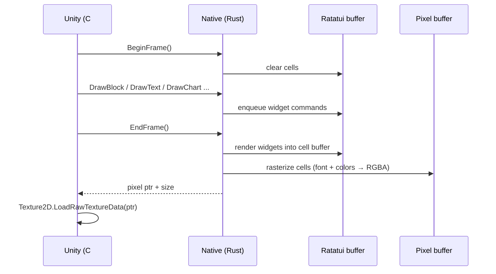

# Architecture

`ratatui-unity` is two halves stitched by a thin C ABI:

- **Rust core** (`src/`) — wraps [`ratatui`](https://ratatui.rs), maintains terminal state, layouts widgets, rasterizes the resulting buffer of cells into RGBA pixels via [`fontdue`](https://github.com/mooman219/fontdue).
- **Unity C# bindings** (`Packages/com.farukcan.ratatui.unity/Runtime/`) — calls into the native crate via `DllImport`, marshals a `Texture2D` per frame.

## Frame Flow

## Module Map (Rust)

| Module          | Responsibility                                  |
|-----------------|-------------------------------------------------|
| `lib.rs`        | C ABI exports (`ratatui_*` functions)           |
| `terminal.rs`   | Terminal lifetime, frame state, command queue   |
| `commands.rs`   | Widget builders the C ABI translates into       |
| `renderer.rs`   | Cell buffer → RGBA pixel pipeline               |
| `font.rs`       | `fontdue` font cache, glyph rasterization       |
| `color.rs`      | Ratatui `Color` → RGBA conversion               |

## C# Surface (Unity)

| Type                  | Role                                                 |
|-----------------------|------------------------------------------------------|
| `RatatuiTerminal`     | High-level handle: `BeginFrame` / `Draw*` / `EndFrame` |
| `RatatuiRenderer`     | Texture management & frame pacing                    |
| `RatatuiNative`       | Raw `DllImport` declarations                         |
| `CanvasBuilder`       | Fluent builder for the Canvas widget                 |
| `ChartBuilder`        | Fluent builder for Chart widget                      |
| `Constraint`          | Layout constraints (`Length`, `Min`, `Percentage` …) |
| `StyledText`, `ITab`  | Styling and tabular widget helpers                   |

## Memory & Lifetime

- Each `RatatuiTerminal` owns a Rust-side `Terminal` allocated by `ratatui_terminal_new` and freed by `ratatui_terminal_free`.
- The pixel buffer lives in Rust; C# receives a borrowed pointer per frame and must copy via `Texture2D.LoadRawTextureData` *before* the next `EndFrame()`.
- `RatatuiTerminal.Dispose()` is mandatory — `using` block or explicit call. Letting the C# object get GC'd without Dispose leaks the Rust terminal.

See the [Rust API](../rust/ratatui_unity/index.html) for the exact `extern "C"` surface, and the [C# API](xref:RatatuiUnity) for the wrappers Unity code touches.
