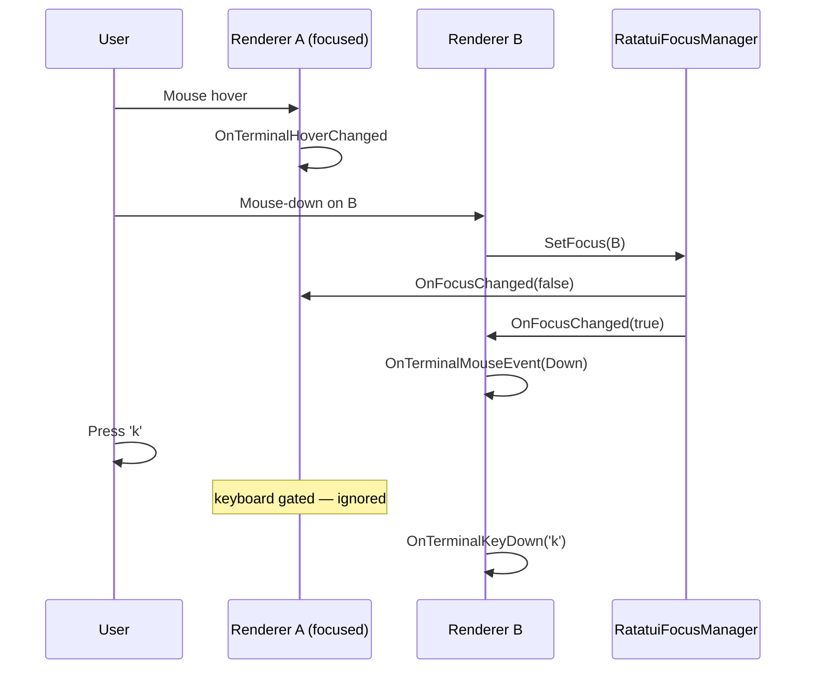

# Focus and Multi-Terminal Scenes

When a scene contains more than one `RatatuiRenderer`, input has to be arbitrated: a single key press should not be delivered to every terminal at once. `RatatuiFocusManager` provides a click-to-focus model that keeps the natural mouse behavior intact while routing keyboard exclusively to the focused renderer.

## Behavior at a Glance

| Input | Non-focused renderer | Focused renderer |
|-------|----------------------|------------------|
| **Mouse hover / move** | Receives events on its own surface, unless covered by a higher-Z renderer | Receives events on its own surface |
| **Mouse click / scroll** | Receives the event (if visible); focus transfers on mouse-down | Receives the event |
| **Keyboard** | Ignored | Receives all `OnTerminalKeyDown` events |

Rationale: mouse position naturally targets exactly one renderer through raycast / rect hit-testing, so suppressing mouse on non-focused renderers would only hide useful hover state. Keyboard is global in Unity's input API, so it must be gated.

## Z-order: Who Wins When Renderers Overlap

When multiple renderers' surfaces cover the same screen point, only the visually frontmost one receives mouse input. The other ones return `false` from cell hit-testing and skip the raycast entirely (no bleed-through).

**Cross-layer priority** (top to bottom):

1. **OnGUI** — IMGUI windows draw last in Unity's frame, on top of everything else.
2. **RawImage (UI Canvas)** — overlays 3D geometry but sits beneath IMGUI.
3. **MeshRenderer** — in-world 3D, behind both UI and IMGUI.

So a click on an OnGUI window over a Canvas RawImage over a mesh terminal only hits the OnGUI one.

**Same-layer tiebreakers:**

- **OnGUI vs OnGUI:** mode is the primary order — **`OnGuiMode.Window` > `Partial` > `Full`**. `Full` covers the whole screen but acts as a background canvas, so a `Window` or `Partial` drawn over it always wins. Within the same mode, focused wins; if neither is focused, both can register where they overlap.
- **RawImage vs RawImage:** higher `Canvas.sortingOrder` wins. Equal sortingOrder falls back to letting both register.
- **MeshRenderer vs MeshRenderer:** `Physics.Raycast` naturally returns the nearest hit; nothing extra needed.

`GUI.depth` is set per-renderer to match this same ordering, so the visually-top renderer is always the one that receives input.

If you have two windows of the same kind overlapping and need deterministic arbitration, give them an explicit focus (call `RequestFocus()` on the one you want forward) or set distinct Canvas `sortingOrder` values.

## Lifecycle

- A renderer auto-registers with `RatatuiFocusManager` in `OnEnable` and unregisters in `OnDisable`.
- **Every newly enabled or instantiated renderer takes focus**, so freshly opened terminals are immediately ready for keyboard input. In multi-renderer scenes the last one to enable wins; call `RequestFocus()` on a specific renderer to override the order.
- A mouse-down anywhere inside a renderer's surface transfers focus to it.
- Disabling the focused renderer clears focus; no fallback is auto-picked. Call `RequestFocus()` on the desired renderer if you want to restore it.

## Public API

```csharp
// On a renderer instance:
bool isFocused = renderer.IsFocused;
renderer.RequestFocus();      // make this the focused renderer

// On the manager:
RatatuiRenderer current = RatatuiFocusManager.Focused;
RatatuiFocusManager.SetFocus(renderer);
RatatuiFocusManager.ClearFocus();

RatatuiFocusManager.FocusChanged += (oldR, newR) => {
    Debug.Log($"focus: {oldR} -> {newR}");
};
```

## Reacting to Focus in a Subclass

```csharp
protected override void OnFocusChanged(bool isFocused)
{
    base.OnFocusChanged(isFocused);   // important: resets stale held-key state

    if (isFocused) HighlightBorder();
    else           DimBorder();
}
```

Always call `base.OnFocusChanged(isFocused)`. The base implementation clears the held-key tracker so a key that was being held when focus was lost does not auto-repeat the moment focus comes back.

## Window Mode Visuals

In `OnGuiMode.Window`, the focused window draws on top of others via `GUI.depth` and its title bar uses `_windowTitleBarColorFocused` (slightly brighter); non-focused windows use `_windowTitleBarColor` (dim). Both colors are SerializeFields on the renderer — set them to match your theme.

## Event Flow



## Patterns

**Background log terminal that should not steal focus.** Don't disable input — instead, never call `RequestFocus()` on it, and the first time it gets a click the user explicitly asked to interact with it.

**Modal dialog terminal.** When opening, call `dialog.RequestFocus()`. When closing, the previously focused renderer is *not* restored automatically; track the previous focus yourself if you need that:

```csharp
RatatuiRenderer _previousFocus;
public void OpenDialog() {
    _previousFocus = RatatuiFocusManager.Focused;
    _dialog.gameObject.SetActive(true);
    _dialog.RequestFocus();
}
public void CloseDialog() {
    _dialog.gameObject.SetActive(false);
    if (_previousFocus != null) _previousFocus.RequestFocus();
}
```

**Tab-cycle focus across renderers.** Listen to a global Ctrl+Tab via a separate `MonoBehaviour` (any one of the renderers will do) and rotate `RatatuiFocusManager.Focused` through your registered list.

## Related

- [Input Handling](input-handling.md) — keyboard, mouse, hover hooks themselves.
