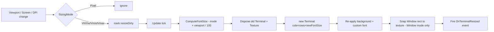
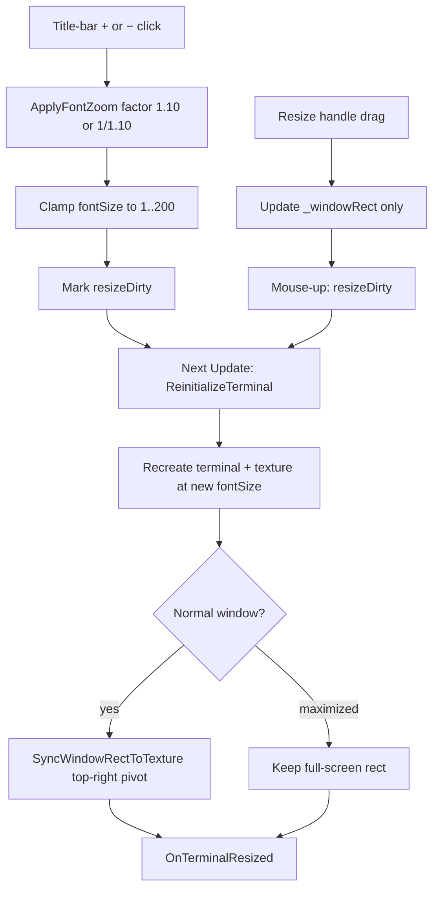

# Resolution & Readability

`RatatuiRenderer` ships with five sizing modes, modelled after CSS viewport-relative length units. Cols × rows are always preserved; only the per-cell pixel scale (i.e. `fontSize`) changes between modes.

## Sizing Modes

| Mode    | `fontSize` interpretation                                              | Refits on viewport change? |
|---------|------------------------------------------------------------------------|----------------------------|
| `Pixel` | Absolute pixels. `fontSize=14` → 14 px cell height-ish.                | No (created once at Awake) |
| `Vh`    | Percent of viewport **height**. `fontSize × height / 100`.             | Yes                        |
| `Vw`    | Percent of viewport **width**. `fontSize × width / 100`.               | Yes                        |
| `Vmin`  | Percent of the **smaller** viewport edge — `min(width, height)`.       | Yes                        |
| `Vmax`  | Percent of the **larger** viewport edge — `max(width, height)`.        | Yes                        |

Select the mode from the **Resolution / Readability** inspector header on `RatatuiRenderer`.

### When to pick which

- **`Pixel`** — single-resolution builds, 3D mesh targets, or when you want pixel-perfect control.
- **`Vmin`** — default recommendation for multi-device apps. The font stays readable whether the viewport is portrait or landscape, and the terminal never overflows in either dimension.
- **`Vh`** — text height should track the screen's vertical space. Useful when columns are unrestricted but you have strict vertical layout.
- **`Vw`** — text height should track horizontal space. Useful for ultrawide layouts.
- **`Vmax`** — text scales with the larger edge, growing aggressively in landscape orientation. Rare; useful for full-bleed dashboards.

## Viewport Definition

The "viewport" is the pixel area used as the basis for `Vh / Vw / Vmin / Vmax`:

| Renderer target            | Viewport                                                |
|----------------------------|---------------------------------------------------------|
| `RawImage` assigned        | RawImage's RectTransform pixel size                     |
| OnGUI Full / Partial / mesh| `Screen.width × Screen.height`                          |
| OnGUI Window (maximized)   | `Screen.width × (Screen.height − titleBarHeight)`       |
| OnGUI Window (normal)      | `Screen.width × (Screen.height − titleBarHeight)`       |

> In Window mode the fontSize basis is always the **screen**, never the window's own rect. The window chrome is sized from the resulting texture, so using it as the fontSize basis would be self-referential and compound across refits.

## Refit Pipeline



Triggers feeding the dirty flag:

- **`OnRectTransformDimensionsChange`** — Unity fires this on the MonoBehaviour whenever the RawImage's parent layout changes. Detected immediately.
- **`Screen` polling** — Every `Resize Poll Seconds` the renderer compares `Screen.width / height / dpi` against the last snapshot. Covers OnGUI paths and mobile rotation / DPI metadata refreshes.
- **Window maximize toggle** — `OnGuiMode.Window` swaps target area between `_windowRect` and `Screen`, which changes the viewport basis.
- **`ForceRefit()`** — Public method for manual triggering after code-driven viewport mutations.

## State Preservation on Refit

The native terminal handle is destroyed and recreated each refit, but the renderer re-applies:

- The configured `BackgroundColor`.
- The cached custom font bytes (last `SetCustomFont` call).
- The active `Texture2D` is reassigned to the `RawImage` / mesh material automatically.

Frame content lives in your `BuildFrame` override and is reconstructed every frame, so no content is lost. Cell-space mouse coordinates use the current `Terminal.Cols / Rows`, so they remain correct after refit.

Subscribe to `OnTerminalResized(cols, rows, fontSize)` if your component caches `PixelWidth / Height` or any cell metric:

```csharp
renderer.OnTerminalResized += (cols, rows, fontSize) =>
{
    Debug.Log($"refit → {cols}×{rows} @ {fontSize:F1}px");
};
```

## OnGUI Window Mode

`OnGuiMode.Window` is fully supported under viewport-relative modes:

- **Maximized**: the terminal fits the screen minus the title-bar height; fontSize tracks `Screen` changes.
- **Normal window**: fontSize is scaled against the **screen** (the stable viewport), then the window chrome snaps to wrap the new terminal texture exactly, keeping its on-screen position. `FitColsAndRows`, when enabled, still fills the actual `_windowRect` content area.
- **Maximize toggle**: switching in/out of maximize marks the terminal dirty, so the next `Update` recomputes fontSize against the new target area.

### Title-bar controls (zoom & resize)

Window chrome includes macOS-style traffic lights on the left and three square controls on the right (laid out inward from the far-right corner):

| Control | Color | Behavior |
|---------|-------|----------|
| **Resize handle** (`✴︎`) | Blue square | Drag to change the window frame size. `fontSize` is unchanged; with **Fit Cols And Rows** enabled, the grid is recomputed on mouse-up to fill the new content area. Dimmed while maximized. |
| **− (zoom out)** | Blue square | Multiplies `fontSize` by `1 / 1.10` (~9% smaller per click). |
| **+ (zoom in)** | Blue square | Multiplies `fontSize` by `1.10` (~10% larger per click). |

Zoom buttons stay active in all window states, including maximized. `fontSize` is clamped to **1–200** px (or viewport-percent units when using `Vh` / `Vw` / `Vmin` / `Vmax`). Clicks that would not change `fontSize` (already at a clamp limit) are ignored.

Zoom and resize are separate levers:

- **Zoom** adjusts cell scale (`fontSize`) and refits the terminal texture; the window frame is then snapped to wrap the new texture.
- **Resize** adjusts only the window frame; cell scale stays the same until refit recomputes cols × rows for the new content area.



**Refit pivot:** after a zoom refit in normal (non-maximized) window mode, `SyncWindowRectToTexture` uses a **top-right anchor** — the right and top edges of the window stay fixed so the zoom buttons and resize handle do not jump horizontally. Manual resize-drag uses a **bottom-left anchor** instead (left and bottom edges pinned) so the handle tracks the cursor naturally; that difference is intentional.

**Pixel mode:** viewport polling is skipped, but zoom still sets `resizeDirty` explicitly so `ReinitializeTerminal` runs on the next `Update`.

Programmatic equivalent: change the renderer's `FontSize` (or config `fontSize`) and call `ForceRefit()` — the title-bar buttons are a convenience UI over the same refit pipeline.

## Fit Cols And Rows

The inspector toggle **Fit Cols And Rows** (under `Rows`) overrides the inspector-set `cols × rows` with values derived from the target pixel area. This makes the terminal grid match the screen / window / RectTransform aspect ratio.

- The fill target is the actual pixel area to cover: RawImage rect, screen (OnGUI Full / maximized / WebGL fullscreen), or the `_windowRect` content area in normal Window mode. (Note: in normal Window mode this is the window rect, whereas the *fontSize* basis is the screen — see *Viewport Definition* above.)
- The grid is recomputed on every refit when `SizingMode` is not `Pixel`. In `Pixel` mode it is computed once at `Awake`.
- Combine with `SizingMode.Vmin` (or another Vh / Vw / Vmin / Vmax) for a fully responsive terminal whose grid **and** cell size both adapt.

## Caveats

- **3D mesh targets** have no natural viewport; the mesh surface is UV-mapped to the terminal texture. Use `Pixel` mode and leave `FitColsAndRows` off.
- `Pixel` mode is fully backwards-compatible with pre-1.x scenes — it was previously called "Fixed".

## Trying It Out

Any renderer works: switch its inspector `SizingMode` to `Vmin` with a small `fontSize` (e.g. `≈ 2.5`), optionally enable **Fit Cols And Rows**, then drag the Game view aspect dropdown (or resize the window) to watch the grid and cell size adapt. Subscribe to `OnTerminalResized` to log live grid / font metrics on each refit.
