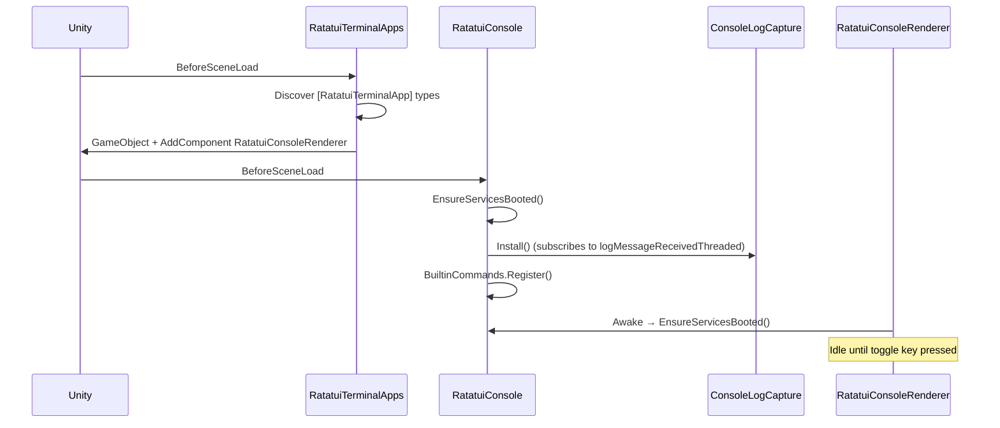

# Developer Console Sample

`Samples~/Console/` is a drop-in runtime developer console: import the sample, hit the toggle key, and you have a live log viewer + command line in any scene without writing any code.

## What You Get (Zero Setup)

- Captures `Debug.Log` / `LogWarning` / `LogError` / exceptions automatically
- Auto-bootstrapped before the first scene loads (no GameObject to drag in)
- Toggle with **`` ` ``** (backtick) by default
- 30+ built-in commands — app/time/scene control, PlayerPrefs, and a Linux-shell-style hierarchy browser (`cd`, `ls`, `tree`, `cat`, `rm`, `mv`, `cp`, …). Full reference: [Built-in Commands](#built-in-commands)
- Quote-aware Tab autocompletion: commands at the start of the line, GameObject paths after a space (relative to the current `cd`'d node)
- Command history (Up/Down arrows), scrollback, log timestamps
- **Window mode** (default): draggable macOS-style frame with title-bar **zoom** (`+` / `−`, ~10% per click) and **resize** (drag the blue `◥` handle) — inherited from `RatatuiRenderer`; see [Resolution & Readability → OnGUI Window Mode](resolution-and-readability.md#ongui-window-mode)

## Boot Flow

The console is a [Terminal App](terminal-apps.md) discovered via `[RatatuiTerminalApp(Id = "console")]`. Services and renderer bootstrap separately:



No GameObject to add manually — import the sample and press Play.

## Pieces

| File | Role |
|------|------|
| `RatatuiConsole.cs` | Public facade: `Open/Close/Toggle`, `TerminalApps`, `RegisterCommand`, `Log`, `ClearLogs`, accessors |
| `RatatuiConsoleConfig.cs` | `ScriptableObject` for dimensions, font size, toggle key, buffer sizes, colors |
| `RatatuiConsoleRenderer.cs` | `[RatatuiTerminalApp]` renderer that paints the log + prompt; uses `TerminalCommandInput` for the command line (see [Input Handling](input-handling.md)) |
| `ConsoleLogCapture.cs` | Hooks `Application.logMessageReceivedThreaded`, owns the log ring buffer |
| `ConsoleCommandRegistry.cs` | Dictionary of registered commands, plus parser (`Parse(raw, out name, out args)`) |
| `ConsoleHistory.cs` | Command-line history (up/down recall) |
| `BuiltinCommands.cs` | Registration of the built-in commands listed above |
| `Resources/RatatuiConsoleConfig.asset` | Default config asset loaded at boot |

## Usage from Game Code

### Toggle / state

```csharp
using RatatuiUnity.Samples.Console;

RatatuiConsole.Toggle();              // open or close
RatatuiConsole.Open();                // takes scene keyboard focus (RatatuiFocusManager)
RatatuiConsole.Close();
bool open = RatatuiConsole.IsOpen;
```

### Register a custom command

```csharp
RatatuiConsole.RegisterCommand("spawn", "Spawn N enemies. Usage: spawn 10",
    args =>
    {
        if (args.Length == 0 || !int.TryParse(args[0], out int n))
        {
            Debug.LogWarning("Usage: spawn <count>");
            return;
        }
        for (int i = 0; i < n; i++) EnemySpawner.Spawn();
    });
```

Anything sent to `Debug.Log` from inside a command shows up in the console output.

### Push a message directly

```csharp
RatatuiConsole.Log("Player connected: " + playerId);
```

### Execute a command programmatically

```csharp
RatatuiConsole.ExecuteCommand("time_scale 0.5");
```

## Built-in Commands

All commands below are registered automatically by `BuiltinCommands.Register()` at boot. They are listed by category. Argument syntax: `<required>` `[optional]` `a|b` (alternatives).

Use `help` at runtime to print the live list.

### Console & application lifecycle

| Command | Description |
|---------|-------------|
| `help` | Print every registered command with its description. |
| `clear` | Empty the log ring buffer. |
| `quit` | Exit the app (`Application.Quit`); in the Editor, leaves play mode. |
| `echo <text…>` | Print the joined argument string back to the console. |
| `version` | Unity version, product name + `Application.version`, platform, editor/player flag. |
| `sysinfo` | OS, device, CPU/GPU, memory totals, screen resolution + refresh rate, platform, internet reachability. |
| `gc` | Force `GC.Collect()` and print managed-memory delta. |

### Terminal apps

For every app registered in `RatatuiTerminalApps`, `BuiltinCommands.Register()` adds a matching pair of commands at boot. The console sample registers as id `console`, so you get `open_console` and `close_console`. A custom app with id `debug` gets `open_debug` and `close_debug`.

| Command | Description |
|---------|-------------|
| `open_<id>` | Open the terminal app with the given id (`RatatuiTerminalApps.Open`). |
| `close_<id>` | Close the terminal app with the given id (`RatatuiTerminalApps.Close`). |

Use `help` at runtime for the full list — it reflects every registered app. From code, `RatatuiConsole.TerminalApps` exposes the same registry as `RatatuiTerminalApps.Apps`.

### Emitting log entries (for testing capture)

| Command | Description |
|---------|-------------|
| `log_warning <text…>` | Emit a `Debug.LogWarning`. |
| `log_error <text…>` | Emit a `Debug.LogError`. |
| `log_exception <text…>` | Emit a `Debug.LogException(new Exception(text))`. |

### Time & framerate

| Command | Description |
|---------|-------------|
| `fps` | Current FPS, `deltaTime`, `unscaledDeltaTime`, `timeScale`, `targetFrameRate`. |
| `time_scale [value]` | No arg: print current `Time.timeScale`. With value: set it (clamped ≥ 0). |
| `target_fps [value]` | No arg: print current `Application.targetFrameRate`. With value: set it (`-1` = unlimited). |
| `pause` | Set `timeScale` to 0; remembers the prior value. |
| `resume` | Restore the `timeScale` captured by the most recent `pause`. |

### Scene control

| Command | Description |
|---------|-------------|
| `scene` | Active scene name + build index, and every loaded scene (`Single`/additive). |
| `scene_load <name\|index> [additive]` | Load by scene name or build index. Append `additive` for `LoadSceneMode.Additive`; default is `Single`. Validates against build settings. |
| `scene_reload` | Reload the currently active scene via its build index, `Single` mode. |

### PlayerPrefs

`prefs <subcommand> [args…]` — flat namespace with five subcommands:

| Form | Description |
|------|-------------|
| `prefs get <key>` | Print the stored value. Probes string → float → int (PlayerPrefs is untagged). Reports `(not set)` if missing. |
| `prefs set <key> <value>` | Infer the type from `<value>`: parses int first, then float, otherwise stores as string. Auto-saves. |
| `prefs del <key>` | Delete one key (alias: `prefs delete`). Auto-saves. |
| `prefs clear` | `PlayerPrefs.DeleteAll()` + save. **No confirmation.** |
| `prefs save` | Force `PlayerPrefs.Save()` (`set`/`del`/`clear` already save). |

### Hierarchy navigation

These behave like a Linux shell where each GameObject is a directory containing its child GameObjects. The current path lives in a static `_cwd`, defaults to `/` (virtual scene root). Inactive GameObjects are visible — they live in the hierarchy regardless of `SetActive` state.

| Command | Description |
|---------|-------------|
| `pwd` | Print the current path. |
| `cd [path]` | Change current path. No arg → `/`. Accepts absolute (`/Player/Body`), relative (`Body`), `..`, `.`. Fails with "Path not found" if the resolved path is missing. |
| `ls [path]` | List immediate children of `path` (or `_cwd`). Each row: `Name (Comp1, Comp2, …)`. Inactive children have a trailing `*`. |
| `tree [path] [depth]` | Tree view with box-drawing connectors. No arg → use `_cwd`. Depth defaults to **3**. `tree 5` is shorthand for "current node, depth 5". Truncates at 500 nodes; dirs cut off by depth show `…(N)` with the unshown child count. |

Path syntax recap:

- `/A/B` — absolute, from scene root.
- `A/B` — relative to `_cwd`.
- `..` pops one segment, `.` is a no-op.
- `/` alone refers to the virtual scene root (the container of all scene-root GameObjects).
- A name with spaces must be quoted: `cd "Main Camera"`.

### Hierarchy inspection

| Command | Description |
|---------|-------------|
| `cat [path]` | Multi-line dump of one GameObject: name + active state, absolute path, scene/layer/tag/static, `activeSelf` vs `activeInHierarchy`, local pos/rot/scale, parent path, child names, component types. Refuses the virtual root. |

### Hierarchy mutation

These run in both edit-mode and play-mode (`Destroy` vs `DestroyImmediate` is chosen automatically). **No confirmation prompts** — pair with discipline.

| Command | Description |
|---------|-------------|
| `rm <path>` | Destroy the GameObject (and its subtree). Refuses to destroy the virtual root. |
| `mv <src> <dest>` | POSIX semantics. If `dest` is an existing GameObject → move `src` into it under its original name. If `dest` doesn't exist → split into parent + new name; parent must exist, `src` is reparented and renamed. Detects parent-into-descendant cycles. |
| `cp <src> <dest>` | Same destination rules as `mv`, but instantiates a clone (`Object.Instantiate`) instead of moving. The clone takes the resolved name — no `(Clone)` suffix. |
| `enable <path>` | `SetActive(true)`. |
| `disable <path>` | `SetActive(false)`. |
| `toggle <path>` | Flip `activeSelf`. |

`mv` / `cp` destination semantics in one table:

| Form | `dest` state | Result |
|------|-------------|--------|
| `cp A B` | `B` missing, parent (`/`) exists | clone at `/B` |
| `cp A B` | `B` exists | clone is added under `B`, named `A` |
| `cp A /` | always | clone at `/A` (scene root) |
| `cp A /X/Y` | `/X/Y` missing, `/X` exists | clone at `/X/Y` |
| `cp A /X/Y` | `/X/Y` exists | clone under `/X/Y`, named `A` |
| `cp A /X/Y` | `/X` missing | error (`destination parent not found`) |

### Tab autocompletion

`Tab` completes whichever token the cursor is in:

- **Before the first space** → command-name completion against the registry.
- **After the first space** → path completion of the last whitespace-delimited token, resolved against `_cwd`.

Behaviour details:

- The popup shows up to 6 suggestions; `↑`/`↓` cycle through them, `Tab` applies the highlighted one. Suggestions for directories (nodes with children) show a trailing `/` and **do not** insert a trailing space, so you can immediately keep typing the next segment.
- Quote-aware: if a candidate name contains a space, the inserted text wraps the affected segment in quotes (e.g. `cd "Main Camera"`, `cd "Main Camera"/Body`). Tokens you start with an unmatched `"` are recognised — typing `cd "Main Ca<Tab>` completes the quoted segment correctly.
- Detail column shows the first three components of the candidate (`Transform, Camera, AudioListener, …`).

### Programmatic access

Built-in commands are just registrations against `RatatuiConsole.RegisterCommand`. Anything you register at runtime appears in `help`, in autocomplete, and via `ExecuteCommand`. Override a built-in by registering the same name — the registry stores by key, so the later registration wins.

## Configuration

Either edit `Samples~/Console/Resources/RatatuiConsoleConfig.asset` after import, or create your own via **Assets → Create → Ratatui → Console Config** and drop it under any `Resources/` folder named exactly `RatatuiConsoleConfig`.

Knobs:

| Field | Default | Purpose |
|-------|---------|---------|
| `cols`, `rows` | 120 × 32 | Fallback terminal grid. The console enables **Fit Cols And Rows**, so the grid is derived from the available pixel area at startup (these values are only used if that area is unavailable). |
| `fontSize` | 1.6 | Glyph size. Interpreted per `sizingMode`: absolute pixels in `Pixel`, or percent of the viewport in `Vh` / `Vw` / `Vmin` / `Vmax` |
| `sizingMode` | `Vmin` | How `fontSize` is interpreted. `Vmin` = percent of the smaller viewport dimension, so glyphs stay readable in both portrait and landscape |
| `displayMode` | `Window` | `Full` stretches to screen, `Partial` uses native pixel size, `Window` is a draggable frame whose title bar shows the host GameObject name |
| `windowStartMaximized` | `true` | When `displayMode` is `Window`, maximize on first open |
| `horizontalAlign` / `verticalAlign` | Center / Top | Placement in `Partial` mode |
| `backgroundColor` | `#121221` | Terminal background |
| `toggleKey` | `` ` `` (BackQuote) | Open/close key |
| `maxLogEntries` | 2000 | Log ring buffer size |
| `maxHistoryEntries` | 64 | Command history size |
| `showTimestamp` | true | Prefix each line with `[HH:mm:ss]` |

`RatatuiConsoleRenderer` applies the config in `ApplyConfigToBase` and always enables **Fit Cols And Rows**, so zoom and resize both keep the log grid filled to the current window content area.

### Adjusting readability at runtime

With the default `displayMode` of `Window`:

1. Open the console (`` ` `` by default).
2. Use the blue **+** / **−** buttons on the title bar to zoom glyph size in or out (~10% per click, clamped to 1–200 in the active sizing units).
3. Drag the blue **◥ resize handle** (far right) to change how much screen area the window occupies without changing glyph scale; the column/row count adapts on release.

Zoom works even when the window is maximized (green traffic-light). Resize is disabled while maximized. Initial `fontSize` and `sizingMode` from the config asset set the starting scale; zoom adjusts from there for the session (not persisted back to the asset).

For viewport-relative sizing (`Vmin`, etc.), see [Resolution & Readability](resolution-and-readability.md).

## Caveat: Input System

Terminal apps (including the console) use `UnityEngine.Input` (legacy). If your project has **Player Settings → Active Input Handling = "Input System Package (New)"**, `RatatuiTerminalApps` logs a warning at boot and does not instantiate apps. Set it to **"Both"** or **"Input Manager (Old)"** to use this sample as-is. See [Terminal Apps](terminal-apps.md).

## Extending

To replace just the renderer (custom layout, different keybinds) while keeping the log capture + command registry: implement your own `MonoBehaviour : RatatuiRenderer` and use `RatatuiConsole.Logs`, `RatatuiConsole.Registry`, `RatatuiConsole.History` as data sources. The facade stays — only the visual layer changes.
