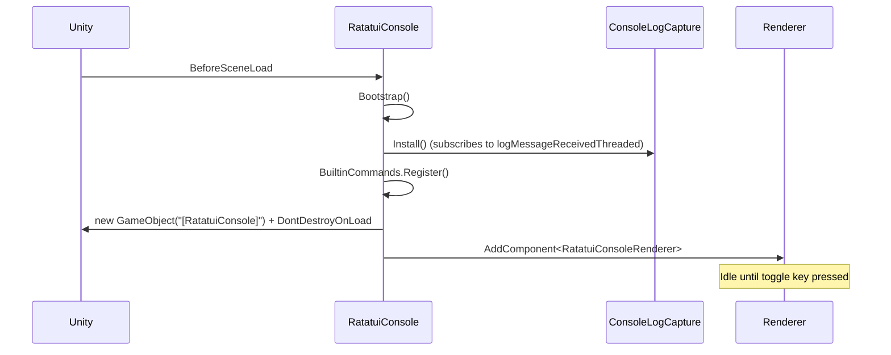

# Developer Console Sample

`Samples~/Console/` is a drop-in runtime developer console: import the sample, hit the toggle key, and you have a live log viewer + command line in any scene without writing any code.

## What You Get (Zero Setup)

- Captures `Debug.Log` / `LogWarning` / `LogError` / exceptions automatically
- Auto-bootstrapped before the first scene loads (no GameObject to drag in)
- Toggle with **`` ` ``** (backtick) by default
- Built-in commands: `help`, `clear`, `quit`, `echo`, `version`, `fps`, `scene`, `time_scale`, `target_fps`, `sysinfo`, `pause`, `resume`, `gc`, `log_warning`, `log_error`, `log_exception`
- Command history (Up/Down arrows), scrollback, log timestamps

## Boot Flow



The whole pipeline is `[RuntimeInitializeOnLoadMethod(BeforeSceneLoad)]` — no GameObject to add manually.

## Pieces

| File | Role |
|------|------|
| `RatatuiConsole.cs` | Public facade: `Open/Close/Toggle`, `RegisterCommand`, `Log`, `ClearLogs`, accessors |
| `RatatuiConsoleConfig.cs` | `ScriptableObject` for dimensions, font size, toggle key, buffer sizes, colors |
| `RatatuiConsoleRenderer.cs` | The `RatatuiRenderer` that paints the log + prompt and handles input |
| `ConsoleLogCapture.cs` | Hooks `Application.logMessageReceivedThreaded`, owns the log ring buffer |
| `ConsoleCommandRegistry.cs` | Dictionary of registered commands, plus parser (`Parse(raw, out name, out args)`) |
| `ConsoleHistory.cs` | Command-line history (up/down recall) |
| `BuiltinCommands.cs` | Registration of the built-in commands listed above |
| `Resources/RatatuiConsoleConfig.asset` | Default config asset loaded at boot |

## Usage from Game Code

### Toggle / state

```csharp
using RatatuiUnity.Samples.Console;

RatatuiConsole.Toggle();              // open or close
RatatuiConsole.Open();
RatatuiConsole.Close();
bool open = RatatuiConsole.IsOpen;
```

### Register a custom command

```csharp
RatatuiConsole.RegisterCommand("spawn", "Spawn N enemies. Usage: spawn 10",
    args =>
    {
        if (args.Length == 0 || !int.TryParse(args[0], out int n))
        {
            Debug.LogWarning("Usage: spawn <count>");
            return;
        }
        for (int i = 0; i < n; i++) EnemySpawner.Spawn();
    });
```

Anything sent to `Debug.Log` from inside a command shows up in the console output.

### Push a message directly

```csharp
RatatuiConsole.Log("Player connected: " + playerId);
```

### Execute a command programmatically

```csharp
RatatuiConsole.ExecuteCommand("time_scale 0.5");
```

## Configuration

Either edit `Samples~/Console/Resources/RatatuiConsoleConfig.asset` after import, or create your own via **Assets → Create → Ratatui → Console Config** and drop it under any `Resources/` folder named exactly `RatatuiConsoleConfig`.

Knobs:

| Field | Default | Purpose |
|-------|---------|---------|
| `cols`, `rows` | 120 × 32 | Terminal grid |
| `fontSize` | 14 px | Glyph size in pixels |
| `displayMode` | `Partial` | `Full` stretches to screen, `Partial` uses native pixel size |
| `horizontalAlign` / `verticalAlign` | Center / Top | Placement in `Partial` mode |
| `backgroundColor` | `#121221` | Terminal background |
| `toggleKey` | `` ` `` (BackQuote) | Open/close key |
| `maxLogEntries` | 2000 | Log ring buffer size |
| `maxHistoryEntries` | 64 | Command history size |
| `showTimestamp` | true | Prefix each line with `[HH:mm:ss]` |

## Caveat: Input System

The renderer uses `UnityEngine.Input` (legacy). If your project has **Player Settings → Active Input Handling = "Input System Package (New)"**, the console will log a warning at boot and refuse to start. Set it to **"Both"** or **"Input Manager (Old)"** to use this sample as-is.

## Extending

To replace just the renderer (custom layout, different keybinds) while keeping the log capture + command registry: implement your own `MonoBehaviour : RatatuiRenderer` and use `RatatuiConsole.Logs`, `RatatuiConsole.Registry`, `RatatuiConsole.History` as data sources. The facade stays — only the visual layer changes.
