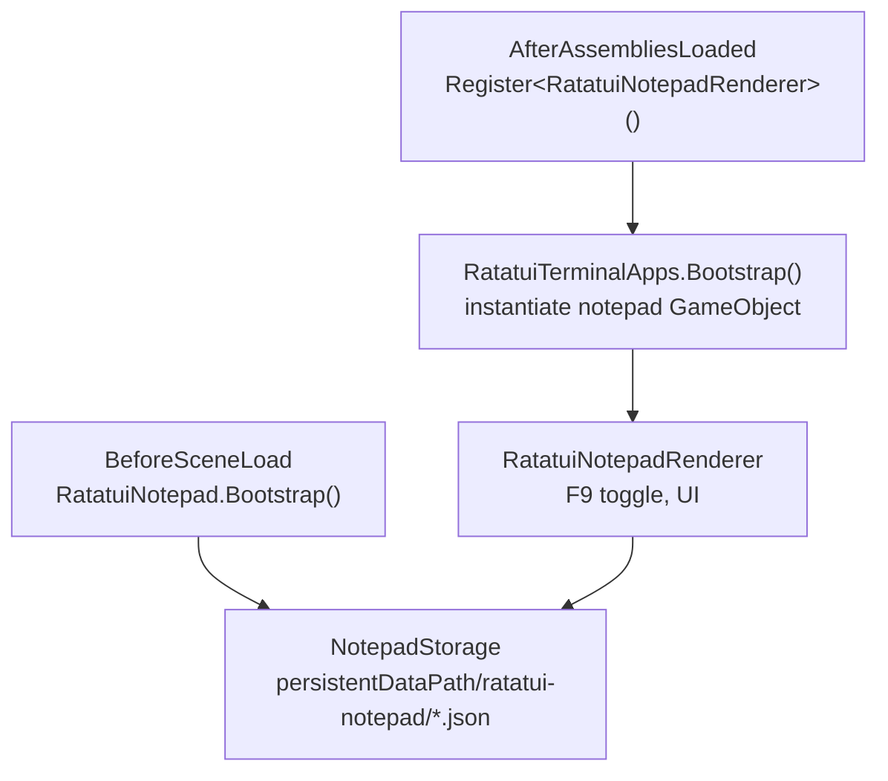
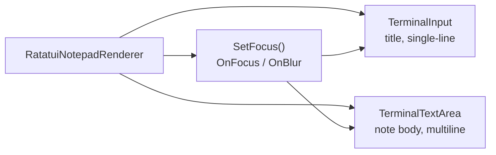

# Notepad Sample

The Notepad sample is a scene-independent terminal app that lets you create, edit, and delete notes with a title and multiline body. Notes persist as JSON files under `Application.persistentDataPath/ratatui-notepad/`.


Import via **Window → Package Manager → ratatui-unity → Samples → Notepad → Import**.

## Quick Start

The app boots automatically before the first scene — no scene setup required.

| Action | Input |
|--------|-------|
| Toggle notepad | **F9** |
| Open note list | **F2** or click **[ F2 OPEN ]** (list closes after you pick a note) |
| New note | **F5** or click **[ F5 NEW ]** |
| Save note | **F3** or click **[ F3 SAVE ]** |
| Delete note | **F4** or click **[ F4 DELETE ]** while the list is open |
| Close list | **Esc** (while list is open) |
| Close notepad | **Esc** or **F9** (editor state is kept in memory until you click **SAVE**) |
| Cycle focus (title ↔ note) | **Tab** / **Shift+Tab** |
| Select all (title or note) | **Cmd/Ctrl+A** |
| Copy / cut / paste | **Cmd/Ctrl+C** / **Cmd/Ctrl+X** / **Cmd/Ctrl+V** |
| Undo / redo | **Cmd/Ctrl+Z** / **Cmd/Ctrl+Shift+Z** or **Cmd/Ctrl+Y** |
| New line (note body) | **Enter** |
| Delete word | **Ctrl+Backspace** / **Ctrl+Delete** |

Mouse (note body): click to position cursor, double-click a word, triple-click all, drag to select, scroll wheel moves the view without moving the cursor. The title field is single-line (`TerminalInput`); the note body is multiline (`TerminalTextArea`). See [Input Handling](input-handling.md) for the full widget API.

From code:

```csharp
using RatatuiUnity.Samples.Notepad;

RatatuiNotepad.Open();
RatatuiNotepad.Toggle();
bool open = RatatuiNotepad.IsOpen;
string path = RatatuiNotepad.StoragePath;
```

## Architecture



| Type | Role |
|------|------|
| `RatatuiNotepad` | Public facade: `Open` / `Close` / `Toggle`, config, storage path |
| `RatatuiNotepadRenderer` | Terminal app UI: note list, title field, `TerminalTextArea` |
| `NotepadStorage` | Load/save/delete JSON files in persistent storage |
| `RatatuiNotepadConfig` | Terminal dimensions, display mode, toggle key |

## Input Widgets



- **Title** — `TerminalInput` with `SelectAllOnFocus = false` so Tab focus does not wipe the title.
- **Note** — `TerminalTextArea` with vertical/horizontal scrollbars and `OwnsArea` routing for mouse wheel and scrollbar hit areas.
- **Focus** — three targets (list, title, note). Tab cycles title ↔ note when the list is closed; opening the list moves focus to the picker.

## Persistence

Each note is stored as `{id}.json`:

```json
{
  "title": "Shopping list",
  "content": "Milk\nEggs\nBread"
}
```

- **Directory:** `Application.persistentDataPath/ratatui-notepad/`
- **Id:** GUID filename (stable even when the display title changes)
- **Session state:** unsaved edits stay in memory across F9 toggle and Open-list close; click **SAVE** to persist to disk

## Configuration

At boot, `RatatuiNotepad` loads `Resources/RatatuiNotepadConfig` (shipped with the sample). If the asset is missing, an in-memory default is used.

To customize: duplicate or edit the asset under `Samples~/Notepad/Resources/`, or create one via **Create → Ratatui → Notepad Config** and place it at `Resources/RatatuiNotepadConfig`.

| Field | Default | Purpose |
|-------|---------|---------|
| `toggleKey` | `F9` | Keyboard toggle |
| `cols` / `rows` | 100 × 28 | Terminal size |
| `fontSize` | `14` | OnGUI font size |
| `sizingMode` | `Pixel` | How cols/rows map to screen pixels |
| `displayMode` | `Window` | OnGUI display mode (`Full`, `Partial`, `Window`) |
| `horizontalAlign` / `verticalAlign` | Center / Center | Alignment when `displayMode = Partial` |
| `windowStartMaximized` | `false` | Initial window state |
| `backgroundColor` | Black | Clear color behind the terminal texture |
| `windowChromeFont` | JetBrains Mono | Title-bar font in Window mode |

## See Also

- [Input Handling](input-handling.md) — `TerminalInput`, `TerminalTextArea`, focus management, mobile keyboard
- [Terminal Apps](terminal-apps.md)
- [Developer Console](samples-console.md)
- [Profiler](samples-profiler.md)
- [Samples Overview](samples-overview.md)
