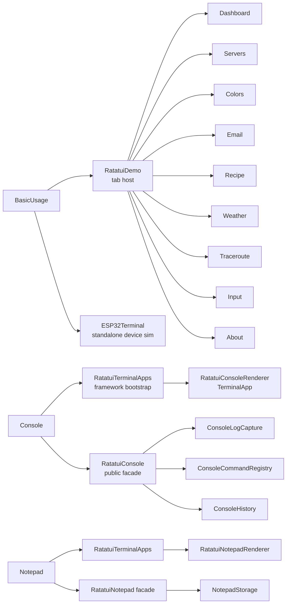

# Samples Overview

The UPM package ships three runnable samples under `Packages/com.farukcan.ratatui.unity/Samples~/`. Import them via **Window → Package Manager → ratatui-unity → Samples → Import**.

| Sample | Folder | What it shows |
|--------|--------|---------------|
| BasicUsage | `Samples~/BasicUsage/` | Full tabbed demo: 9 tabs covering every widget, layout, input, hover, animation. |
| Developer Console | `Samples~/Console/` | Drop-in runtime console (logs + command registry) auto-bootstrapped before scene load. |
| Notepad | `Samples~/Notepad/` | Persistent notepad terminal app (`TerminalInput` title + `TerminalTextArea` body, F9 toggle). |

Each sample is self-contained — it has its own `.asmdef`, only depends on `RatatuiUnity.Runtime`.

## At-a-Glance

## Next

- [BasicUsage (Tabs Demo)](samples-basic-usage.md) — what each tab demonstrates and how to read its code.
- [Developer Console](samples-console.md) — how to use, configure, and extend the runtime console.
- [Notepad](samples-notepad.md) — persistent notes terminal app.
- [Terminal Apps](terminal-apps.md) — framework for scene-independent terminal apps (open/close, attribute discovery).
