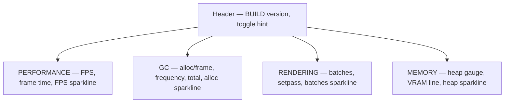
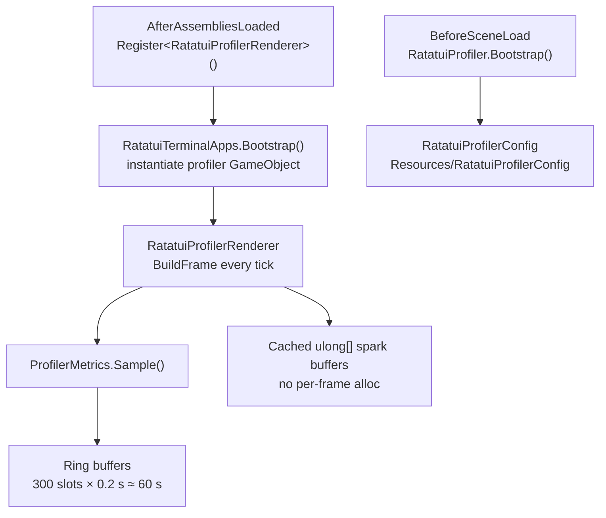

# Profiler Sample

`Samples~/Profiler/` is a read-only runtime telemetry overlay: FPS, frame time, GC allocation, rendering stats, and memory usage in a four-panel dashboard with sparklines. Import the sample, press Play, and toggle the overlay — no scene setup required.

Import via **Window → Package Manager → ratatui-unity → Samples → Profiler → Import**.

## Quick Start

The app boots automatically before the first scene — no GameObject to drag in.

| Action | Input |
|--------|-------|
| Toggle profiler | **F10** (default) |
| Close profiler | **Esc** |

From code:

```csharp
using RatatuiUnity.Samples.Profiler;

RatatuiProfiler.Open();
RatatuiProfiler.Toggle();
bool open = RatatuiProfiler.IsOpen;
RatatuiProfilerConfig cfg = RatatuiProfiler.Config;
```

The overlay is read-only: no text fields, no mouse interaction inside the terminal frame. Window chrome (drag, close, zoom) is handled by the base `RatatuiRenderer`.

## What You See

The UI is a 2×2 grid of bordered panels under a header bar:



| Panel | Metrics | Notes |
|-------|---------|-------|
| **Performance** | FPS, frame time (ms), goal line | FPS color: green ≥ 55, yellow ≥ 28, red below. Sparkline shows ~60 s of FPS history. |
| **GC** | Alloc per frame, collection frequency (Hz), total managed heap | Goal: 0 B/frame. Sparkline tracks per-window GC allocation. |
| **Rendering** | Draw batches, set-pass calls | **Editor only** — uses `UnityEditor.UnityStats`. Player builds show `—` and `(Editor only)` for the sparkline. |
| **Memory** | Managed heap reserved / system RAM total, RAM % gauge, VRAM totals | Heap used comes from `Profiler.GetTotalReservedMemoryLong()`. VRAM used is not available at runtime — gauge shows `n/a`. |

Sparklines scroll left-to-right (oldest → newest). Normalization uses the **1-minute max** across the full history buffer, not just the visible width, so spikes elsewhere in the window still affect bar height.

## Architecture



| Type | Role |
|------|------|
| `RatatuiProfiler` | Public facade: `Open` / `Close` / `Toggle`, config accessor |
| `RatatuiProfilerRenderer` | `[RatatuiTerminalApp("profiler")]` UI: four panels, sparklines, `LineGauge` |
| `ProfilerMetrics` | Per-frame sampling, 200 ms display window, 60 s ring-buffer history |
| `RatatuiProfilerConfig` | Terminal dimensions, display mode, toggle key, window size |

Boot flow matches the other terminal-app samples ([Terminal Apps](terminal-apps.md)): `Register<T>()` at `AfterAssembliesLoaded`, `RatatuiTerminalApps.Bootstrap()` at `BeforeSceneLoad`, renderer created on a `DontDestroyOnLoad` GameObject.

## Metrics Collection

`ProfilerMetrics.Sample(Time.unscaledDeltaTime)` runs every frame while the overlay is open. Raw readings accumulate; displayed values and history slots flush every **200 ms** (`DisplayWindowSeconds = 0.2f`) so labels stay readable and sparklines advance at a steady cadence independent of frame rate.

| Reading | Source | Display |
|---------|--------|---------|
| FPS / frame time | Average `unscaledDeltaTime` over the display window | Instant snapshot + `FpsHistory` |
| GC alloc/frame | Delta of `GC.GetTotalMemory(false)` between frames; negative delta counts as a collection event | Averaged over the window + `GcAllocHistory` |
| GC frequency | Collection events per 1 s rolling window | Hz |
| Batches / set-pass | `UnityEditor.UnityStats` | Editor only; averaged over window |
| Heap used | `Profiler.GetTotalReservedMemoryLong()` | Averaged when > 0; `RamUsedAvailable` flag |
| System / VRAM total | `SystemInfo.systemMemorySize`, `SystemInfo.graphicsMemorySize` | Totals always shown; VRAM used not reported |

History size is **300 slots** at 0.2 s each ≈ **60 seconds** of data (`HistorySize = 300`).

## Sparkline Rendering (Zero Alloc)

A profiler that allocates every frame would skew its own GC reading. `RatatuiProfilerRenderer` therefore:

1. Keeps reusable `ulong[]` buffers (`_fpsSpark`, `_gcBars`, `_batchesSpark`, `_heapSpark`).
2. Resizes a buffer only when the panel inner width changes.
3. Writes a **ghost slot** at index `width` equal to `SparkScaleCeiling` (10000) so Ratatui's max-of-data normalizer is pinned to the 1-minute max computed in C#, not the visible window max.

This pattern is worth copying for any live dashboard that must not disturb the metrics it measures.

## Configuration

At boot, `RatatuiProfiler` loads `Resources/RatatuiProfilerConfig` (shipped with the sample). If the asset is missing, an in-memory default is used.

To customize: duplicate or edit the asset under `Samples~/Profiler/Resources/`, or create one via **Create → Ratatui → Profiler Config** and place it at `Resources/RatatuiProfilerConfig`.

| Field | Default | Purpose |
|-------|---------|---------|
| `toggleKey` | `F10` | Keyboard toggle |
| `cols` / `rows` | 60 × 30 | Fallback terminal grid; **Fit Cols And Rows** is enabled, so the grid adapts to the window content area |
| `fontSize` | `14` | Glyph size (interpreted per `sizingMode`) |
| `sizingMode` | `Pixel` | How `fontSize` maps to screen pixels |
| `displayMode` | `Window` | OnGUI display mode (`Full`, `Partial`, `Window`) |
| `horizontalAlign` / `verticalAlign` | Right / Top | Placement when `displayMode = Partial` |
| `windowStartMaximized` | `false` | Initial window state |
| `windowInitialWidth` / `windowInitialHeight` | 520 × 420 px | Starting window size in Window mode (`-1` = auto) |
| `backgroundColor` | `#050608` | Clear color behind the terminal texture |
| `windowChromeFont` | JetBrains Mono | Title-bar font in Window mode |

`RatatuiProfilerRenderer` enables **Fit Cols And Rows**, so zoom and resize keep the four-panel layout filled. See [Resolution & Readability → OnGUI Window Mode](resolution-and-readability.md#ongui-window-mode) for title-bar zoom and resize.

## Console Integration

When the Developer Console sample is also imported, `BuiltinCommands` registers `open_profiler` and `close_profiler` automatically (app id `profiler`). Use `help` at the `` ` `` prompt for the live list.

## Caveat: Input System

Terminal apps (including the profiler) use `UnityEngine.Input` (legacy). If your project has **Player Settings → Active Input Handling = "Input System Package (New)"**, `RatatuiTerminalApps` logs a warning at boot and does not instantiate apps. Set it to **"Both"** or **"Input Manager (Old)"** to use this sample as-is. See [Terminal Apps](terminal-apps.md).

## Extending

To add custom metrics while keeping the facade:

1. Extend `ProfilerMetrics` with new accumulators and history arrays.
2. Add a panel (or row) in `RatatuiProfilerRenderer.BuildBody`.
3. Reuse the existing sparkline helpers (`RenderFloatSparkline`, `RenderLongSparkline`, `RenderIntSparkline`) to stay allocation-free.

To replace the entire layout, subclass `RatatuiTerminalApp` with a new id and register it separately — `RatatuiProfiler` remains the entry point for the stock overlay.

## See Also

- [Terminal Apps](terminal-apps.md) — bootstrap, registry, open/close API
- [Widget Examples](widget-examples.md) — `Sparkline`, `LineGauge`, `Block`, `Split`
- [Developer Console](samples-console.md) — `open_profiler` / `close_profiler` commands
- [Samples Overview](samples-overview.md)
