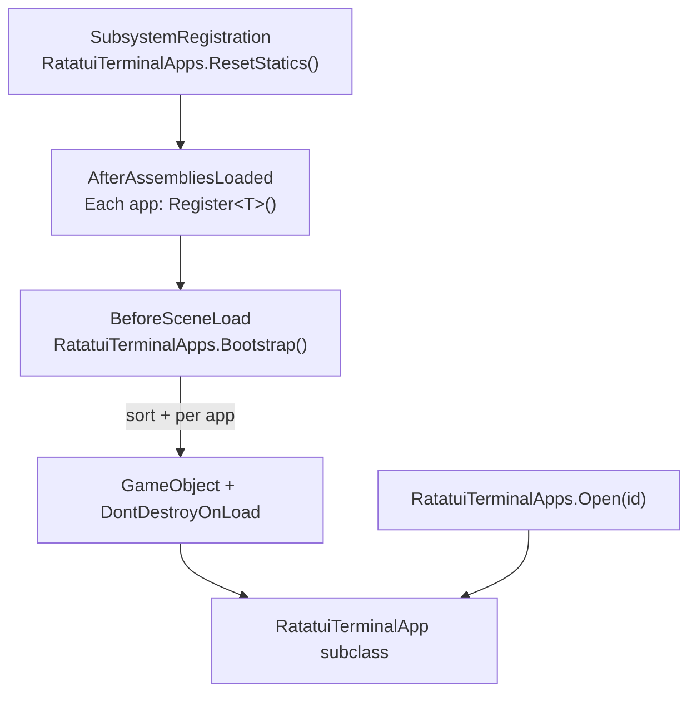

# Terminal Apps

`RatatuiTerminalApps` is a Runtime framework for terminal apps that boot before the first scene, live in `DontDestroyOnLoad` GameObjects, and expose a static open/close API from anywhere in your project.

Each app is a `RatatuiTerminalApp` subclass with its own `RatatuiRenderer` window. The Developer Console and Notepad samples are built-in apps using this system.

## Architecture



| Type | Role |
|------|------|
| `RatatuiTerminalAppAttribute` | Marker attribute: identifies a class as a terminal app (documentation only) |
| `RatatuiTerminalApp` | Abstract base: open/close/toggle, toggle key, 4-finger touch toggle, render guards |
| `TerminalAppHandle` | Registry entry: metadata + live `Instance` + factory delegate |
| `RatatuiTerminalApps` | Static manager: bootstrap, app list, `Register<T>`, `Open` / `Close` / `Toggle` / `Get` |

No reflection — each app explicitly registers itself via `Register<T>()` in a `[RuntimeInitializeOnLoadMethod(AfterAssembliesLoaded)]` static method.

## Writing an App

### 1. Subclass `RatatuiTerminalApp` and self-register

```csharp
using UnityEngine;

namespace MyGame
{
    [RatatuiTerminalApp("debug", DisplayName = "Debug Panel", Order = 10)]
    public sealed class DebugPanelApp : RatatuiTerminalApp
    {
        [RuntimeInitializeOnLoadMethod(RuntimeInitializeLoadType.AfterAssembliesLoaded)]
        private static void RegisterApp()
        {
            RatatuiTerminalApps.Register<DebugPanelApp>("debug", "Debug Panel", order: 10);
        }

        protected override KeyCode ToggleKey => KeyCode.F1;

        protected override void Awake()
        {
            Cols = 80;
            Rows = 24;
            OnGuiDisplayMode = OnGuiMode.Window;
            EnableInput = true;
            base.Awake();
        }

        protected override void BuildFrame(RatatuiTerminal term)
        {
            if (!IsOpen) return;
            term.Block(term.RootArea, " DEBUG ", Borders.All);
            term.DrawText(term.Inner(term.RootArea), "Hello from a terminal app.");
        }

        protected override void OnOpened()
        {
            // App-specific setup when the window opens
        }

        protected override void OnClosed()
        {
            // App-specific cleanup when the window closes
        }
    }
}
```

`RegisterApp()` runs at `AfterAssembliesLoaded` — before `RatatuiTerminalApps.Bootstrap()` instantiates all registered apps at `BeforeSceneLoad`. Do **not** add the component to a scene manually.

### 2. Open / close from game code

```csharp
using RatatuiUnity;

RatatuiTerminalApps.Open("debug");
RatatuiTerminalApps.Close("debug");
RatatuiTerminalApps.Toggle("debug");
bool open = RatatuiTerminalApps.IsOpen("debug");

var app = RatatuiTerminalApps.Get<DebugPanelApp>();
RatatuiTerminalApps.Open<DebugPanelApp>();

foreach (var handle in RatatuiTerminalApps.Apps)
    Debug.Log($"{handle.Id}: {handle.DisplayName} (open={handle.IsOpen})");
```

### 3. `Register<T>` parameters

| Parameter | Required | Purpose |
|-----------|----------|---------|
| `id` | yes | Unique string used by `Open(id)` / `Close(id)` |
| `displayName` | no | Human label (defaults to `id`); also used as the GameObject name |
| `order` | no | Sort order in `RatatuiTerminalApps.Apps` (lower first) |

Duplicate `id` values are skipped with a warning.

`[RatatuiTerminalApp]` is a **marker attribute** — it does not trigger registration. Registration is always explicit via `Register<T>()`.

## Base Class Behaviour

`RatatuiTerminalApp` provides shared lifecycle:

- **`IsOpen` / `SetOpen(bool)` / `Toggle()`** — visibility; opening calls `RequestFocus()` for keyboard input via `RatatuiFocusManager`.
- **`ToggleKey`** — override to bind a keyboard toggle (default `KeyCode.None`).
- **`TouchToggleFingerCount`** — default 4; simultaneous touch count that toggles on full release.
- **`Update()`** — always runs toggle handling; render pipeline runs only when open.
- **`OnOpened()` / `OnClosed()`** — override hooks for app-specific state.
- **`ShouldSuppressToggleKeyEvent(e)`** — call from `OnTerminalKeyDown` to drop toggle-key leakage.
- **`ShouldIgnoreMouseThisFrame()`** — call from `OnTerminalMouseEvent` after opening (area map stale for one frame).

## Developer Console Integration

The [Developer Console sample](samples-console.md) registers as:

```csharp
[RatatuiTerminalApp(Id = "console", DisplayName = "Developer Console", Order = 0)]
public sealed class RatatuiConsoleRenderer : RatatuiTerminalApp
```

`RatatuiConsole` remains the public facade for logs, commands, and history. Open/close delegates to the framework:

```csharp
RatatuiConsole.Open();   // → RatatuiTerminalApps.Open("console")
RatatuiConsole.Toggle(); // → RatatuiTerminalApps.Toggle("console")
```

Console services bootstrap separately in `RatatuiConsole.EnsureServicesBooted()`; the renderer calls this in `Awake` so services exist regardless of bootstrap order.

At boot, the console registers `open_<id>` / `close_<id>` built-in commands for every entry in `RatatuiTerminalApps.Apps` (e.g. `open_console`, `close_console`). `RatatuiConsole.TerminalApps` exposes the same list from game code.

## Caveats

### Input System

Terminal apps use `UnityEngine.Input` (legacy). If **Player Settings → Active Input Handling = "Input System Package (New)"**, `RatatuiTerminalApps` logs a warning at boot and does not instantiate apps. Set **"Both"** or **"Input Manager (Old)"**.

### Sample assembly loading

Apps in sample assemblies (e.g. Console with `autoReferenced: false`) are discovered only when that assembly is compiled into the project (import the sample via Package Manager).

### Eager instantiation

All discovered apps are created at boot. Closed apps still run `Update()` (for toggle keys and background work like log draining) but skip rendering.

## Notepad Integration

The [Notepad sample](samples-notepad.md) registers as:

```csharp
[RatatuiTerminalApp("notepad", DisplayName = "Notepad", Order = 10)]
public sealed class RatatuiNotepadRenderer : RatatuiTerminalApp
```

`RatatuiNotepad` is the public facade. Notes persist under `Application.persistentDataPath/ratatui-notepad/`. Toggle with **F12** (configurable via `RatatuiNotepadConfig`).

```csharp
RatatuiNotepad.Open();   // → RatatuiTerminalApps.Open("notepad")
RatatuiNotepad.Toggle(); // → RatatuiTerminalApps.Toggle("notepad")
```

## See Also

- [Developer Console sample](samples-console.md)
- [Notepad sample](samples-notepad.md)
- [Focus & Multi-Terminal](focus-and-multi-terminal.md)
- [Architecture](architecture.md)
