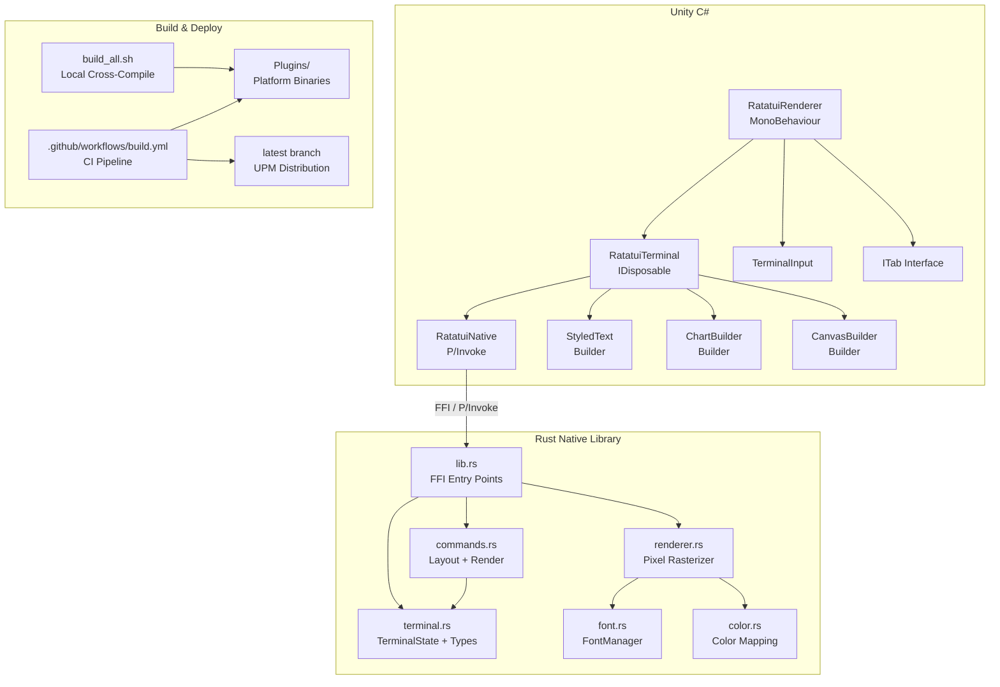

# Structural Analysis — ratatui-unity

Date: 2026-05-21  
Verified: 2026-05-21 (code-only static review; no runtime profiling)

---

## Architecture Overview



**Data flow per frame:**

1. `RatatuiRenderer.Update()` calls `BeginFrame()` -> `BuildFrame()` -> `EndFrameRaw()`
2. Rust side: clears state, receives widget commands via FFI, renders via ratatui `TestBackend`, rasterizes buffer to RGBA pixels via fontdue
3. C# side: loads raw pixel pointer into `Texture2D.LoadRawTextureData(IntPtr, int)` — zero-copy

---

## Findings

### CRITICAL — String Encoding Mismatch (FFI Boundary)

> **Status: Confirmed**  
> **Evidence:** `RatatuiNative.cs` lines 80–250 (all string-bearing `DllImport` declarations), `lib.rs:22–27`

All C# P/Invoke string parameters use `LPStr` with `CharSet = CharSet.Ansi`. On the Rust side, `CStr::from_ptr().to_string_lossy()` expects UTF-8.

- On Windows with a non-Latin system locale, non-ASCII characters (e.g. Turkish "isim", CJK) will be silently corrupted or replaced with `?`.
- On macOS/Linux this often works by accident since the default codepage is UTF-8, but it is not guaranteed.

**Fix:** Replace `UnmanagedType.LPStr` with `UnmanagedType.LPUTF8Str` (supported in Unity 2021+, which is already the minimum version).

---

### HIGH — Missing Finalizer on `RatatuiTerminal`

> **Status: Confirmed**  
> **Evidence:** `RatatuiTerminal.cs:445–456` (Dispose implementation); no `~RatatuiTerminal()` present in the file  
> **Note:** The claim that `OnDestroy` may not fire in all Unity Editor paths is **Speculative — needs runtime evidence**; the structural gap (missing finalizer) is confirmed regardless.

`RatatuiTerminal` is a `sealed` class that implements `IDisposable` but has no finalizer. If a consumer creates an instance without calling `Dispose()` (or using `using`), the native Rust allocation (`Box<TerminalState>`) leaks permanently.

`RatatuiRenderer.OnDestroy()` calls `Dispose()`, but there is no safety net for exception paths or unexpected teardown.

**Fix:** Add a destructor as safety net:

```csharp
~RatatuiTerminal() { Dispose(); }
```

---

### HIGH — Per-Frame Allocations in Render Path

> **Status: Confirmed (code locations)**  
> **Note:** The numeric impact estimates ("~1-2 MB", "GC pressure equivalent") are **Speculative — needs runtime profiling** to quantify. The allocations themselves are confirmed.

Multiple avoidable allocations occur every frame:

| Location         | Allocation                                                 | Confirmed |
| ---------------- | ---------------------------------------------------------- | --------- |
| `renderer.rs:17` | `vec![0u8; ...]` new pixel buffer each frame               | Yes       |
| `commands.rs:70` | `state.area_map.clone()` full HashMap                      | Yes       |
| `lib.rs:91`      | `state.terminal.backend().buffer().clone()`                | Yes       |
| `font.rs:67–73`  | Cache hit: `entry.1.clone()`; cache miss: `bitmap.clone()` | Yes       |

The pixel buffer in `render_buffer_to_pixels` is always the same size (`cols * rows * cell_w * cell_h * 4`). It could be passed in as a `&mut Vec<u8>` and reused — `TerminalState.pixel_buffer` already pre-allocates this in `terminal.rs:213`, but `render_buffer_to_pixels` ignores it and creates a fresh `Vec`.

The `area_map.clone()` in `render_all_commands` exists to avoid a borrow conflict with `state.terminal.draw()`. This could be restructured by extracting the terminal temporarily.

The glyph cache returns `(Metrics, Vec<u8>)` by value with a clone. Returning a reference `&(Metrics, Vec<u8>)` would eliminate per-glyph allocations on the hot path.

---

### MEDIUM — Build Script / CI Target Mismatch (Windows)

> **Status: Confirmed**  
> **Evidence:** `build_all.sh:126`, `.github/workflows/build.yml:89`, `rust-toolchain.toml:13`

| Context               | Windows Target                                           |
| --------------------- | -------------------------------------------------------- |
| `build_all.sh`        | `x86_64-pc-windows-gnu` (MinGW via `cross`)              |
| CI workflow           | `x86_64-pc-windows-msvc` (MSVC, `windows-latest` runner) |
| `rust-toolchain.toml` | `x86_64-pc-windows-msvc`                                 |

The local build script targets a different ABI than CI. The DLL produced by `gnu` and `msvc` toolchains can differ in linking behaviour. Since CI produces the release artifacts, local builds may yield a DLL with different characteristics.

**Fix:** Align `build_all.sh` to use `x86_64-pc-windows-msvc` or document the intentional difference with a clear comment.

---

### MEDIUM — `render_all_commands` Stores Dead Commands Back

> **Status: Confirmed**  
> **Evidence:** `commands.rs:69` (`mem::take`), `commands.rs:286` (re-assignment), `terminal.rs:224` (`commands.clear()` in `begin_frame`)

```rust
let commands = std::mem::take(&mut state.commands);  // line 69
// ... render loop ...
state.commands = commands;  // line 286
```

After rendering, the consumed commands are stored back into `state.commands`. `begin_frame()` unconditionally calls `self.commands.clear()`, so the data is immediately discarded at the start of the next frame. Storing them back wastes memory until then by keeping the owned Strings and Vecs alive for an extra frame.

**Fix:** Drop the commands after the draw closure instead of re-assigning. The `mem::take` already gives ownership; let them drop at end of scope.

---

### MEDIUM — Builder Classes Allow Double-Render

> **Status: Confirmed**  
> **Evidence:** `StyledText.cs:73–76`, `ChartBuilder.cs:66–69`, `CanvasBuilder.cs:103–106`; Rust behaviour confirmed via `pending_*.take()` pattern in `lib.rs`

All three builder classes document "Must be called exactly once; the builder is unusable afterward" but enforce no guard. Calling `Render()` twice calls the native `_end` function twice. The Rust side handles this silently: `pending_styled_para.take()` / `pending_chart.take()` / `pending_canvas.take()` returns `None` on the second call and does nothing. The user receives no feedback that their second call was a no-op.

**Fix:** Add a `bool _rendered` flag, throw `InvalidOperationException` on double-call, and optionally on method calls after `Render()`.

---

### MEDIUM — `ITab.OnInput` Deprecated Without `[Obsolete]`

> **Status: Confirmed**  
> **Evidence:** `ITab.cs:31–32` (comment-only deprecation, no attribute); all 10 sample tabs in `Samples~/BasicUsage/` still provide a `void OnInput(KeyCode key)` body

```csharp
/// <summary>[Deprecated] Use OnKeyEvent instead.</summary>
void OnInput(KeyCode key);
```

This is marked deprecated in XML comment only. Every `ITab` implementor must still provide a body because it is a non-default interface member. Using `[Obsolete("Use OnKeyEvent instead")]` would surface a compiler warning at usage sites without breaking existing code.

**Fix:** Add `[Obsolete("Use OnKeyEvent instead")]` to the declaration. As a follow-up, consider extracting `OnInput` to a separate `ITabCompat` interface or providing a default body so implementors are not forced to implement a deprecated method.

---

### LOW — `RootArea` Property Makes Unnecessary FFI Call

> **Status: Confirmed**  
> **Evidence:** `RatatuiTerminal.cs:46`, `lib.rs:111`

```rust
pub extern "C" fn ratatui_root_area(_handle: *const c_void) -> u32 { 0 }
```

The native function ignores its parameter and always returns `0`. `RatatuiTerminal.RootArea` makes a P/Invoke call on every access. `RatatuiDemo.cs` calls `term.RootArea` each frame. The value is a constant.

**Fix:** Replace the property with `public uint RootArea => 0u;` on the C# side and remove the FFI function or keep it only for future compatibility.

---

### LOW — `TerminalInput._lastAreaId` Set but Never Read

> **Status: Confirmed**  
> **Evidence:** `TerminalInput.cs:16` (field declaration), `TerminalInput.cs:199` (write), `HandleMouseEvent` (uses `_lastAreaX`, not `_lastAreaId`)

`_lastAreaId` is stored on every `Render()` call but `HandleMouseEvent` does not reference it — it relies on `_lastAreaX` for cursor positioning. The field is dead.

**Fix:** Remove the `_lastAreaId` field and the assignment on line 199. If area-aware click routing is needed in the future, add it explicitly at that point.

---

### LOW — `_scrollAccumulator` Drift

> **Status: Speculative — needs runtime evidence**  
> **Evidence:** `RatatuiRenderer.cs:68,298–311` (float subtraction loop confirmed in code)

The scroll accumulator uses floating-point subtraction in a while-loop. The code pattern is correct and a common idiom for normalising continuous scroll input. The concern is theoretical: over very long sessions with many fine-grained trackpad events, floating-point rounding could cause the accumulator to drift away from zero. This is not directly observable from static analysis alone and is unlikely to be user-visible in practice.

**Follow-up:** Measure the accumulator value in a long stress test. If drift is observed, a periodic clamp (`if (Mathf.Abs(_scrollAccumulator) < epsilon) _scrollAccumulator = 0f;`) after the while-loop is sufficient.

---

### INFO — No Unit Tests

> **Status: Confirmed**  
> **Evidence:** No `#[cfg(test)]` modules in any `.rs` file; no Unity test assembly definition (`.asmdef` with `testables`) found

The Rust side has no `#[cfg(test)]` modules and no test files. The C# side has no test assembly. For a library with this much FFI surface area and pixel-level rendering, tests (even snapshot tests) would catch regressions from ratatui version bumps.

---

### INFO — `Cargo.lock` Committed

> **Status: Confirmed (intentional and correct)**  
> **Evidence:** `Cargo.lock` present in repository root

For library crates the convention is to not commit `Cargo.lock`. However, since this crate also produces binary artifacts (cdylib/staticlib), committing it is reasonable for reproducible builds. This is intentional and correct.

---

## Summary

### Confirmed Actionable Findings

| Severity | Count | Key Items                                                           |
| -------- | ----- | ------------------------------------------------------------------- |
| CRITICAL | 1     | String encoding mismatch (`LPStr` vs UTF-8)                         |
| HIGH     | 2     | Missing finalizer; per-frame allocations (locations confirmed)      |
| MEDIUM   | 4     | Build target mismatch, dead commands, double-render, deprecated API |
| LOW      | 2     | Unnecessary FFI call (`RootArea`), unused field (`_lastAreaId`)     |

### Speculative / Needs Runtime Evidence

| Item                       | What is confirmed             | What requires measurement                                  |
| -------------------------- | ----------------------------- | ---------------------------------------------------------- |
| Missing finalizer          | No finalizer exists           | Whether `OnDestroy` actually misses in Unity Editor cycles |
| Per-frame allocations      | Code locations confirmed      | Actual frame-time cost / GC pressure magnitude             |
| `_scrollAccumulator` drift | Float subtraction loop exists | Whether drift is observable over extended real-world usage |

### Informational (no action required)

| Item                   | Status                                    |
| ---------------------- | ----------------------------------------- |
| No unit tests          | Confirmed gap, improvement opportunity    |
| `Cargo.lock` committed | Intentional, correct for binary artifacts |
